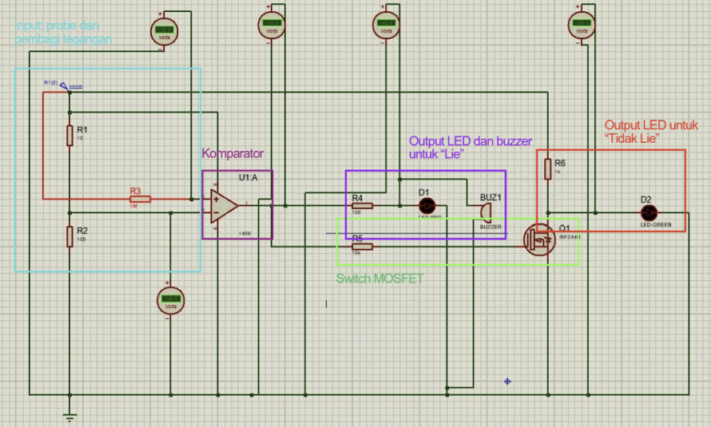
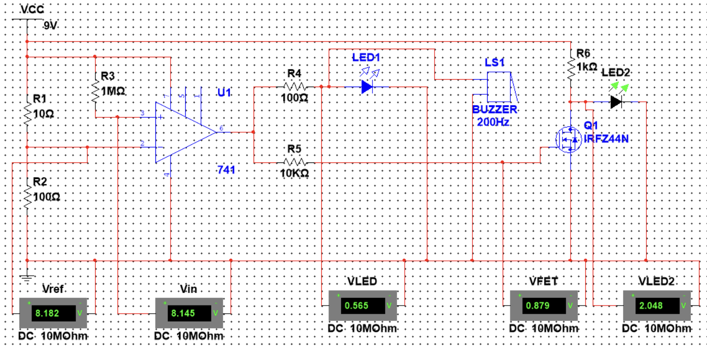
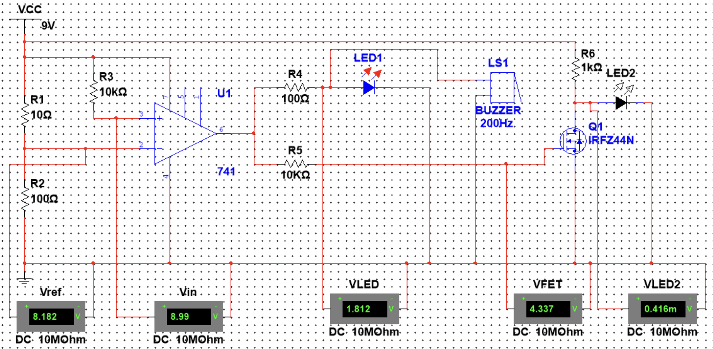

# Sweat Truth: Analog Electrodermal Response Lie Detector

## 📌 Project Overview
**Sweat Truth** is an Analog Electronics project designed to detect physiological stress responses (deception) by monitoring **galvanic skin response (GSR)**.

The system measures the drastic drop in skin resistance caused by sweat gland activity during stress. While commonly known as a "Lie Detector," technically it is an **Electrodermal Activity Monitor**.

**Key Features:**
* **Analog Signal Processing:** Uses Op-Amp comparators and Wheatstone Bridge principles.
* **Dual-State Detection:** Distinctly separates "Relaxed/Truth" vs "Stressed/Lie" states.
* **Proven Implementation:** The design was successfully fabricated into a physical prototype and validated with real subjects, effectively detecting sweat responses on the fingers.

## Circuit Design & Schematic
The circuit utilizes a **voltage divider** input stage where the skin acts as a variable resistor ($R_{skin}$). This input is compared against a reference voltage ($V_{ref}$) set by a potentiometer.

### Schematic Diagram

*Figure 1: Circuit schematic designed in Proteus.*

### Component Translation Key
The schematic above uses Indonesian labels. Please refer to the table below for English translation:

| Indonesian Label (On Image) | English | Description |
| :--- | :--- | :--- |
| **Input: Probe dan Pembagi Tegangan** | Input: Probe and Voltage Divider | Probe: Copper pads touching the skin ($R_{skin}$); Voltage Divider: Converts resistance change to voltage change.|
| **Komparator** | Comparator | Op-Amp (LM1458) comparing Input vs $V_{ref}$ |
| **Output LED untuk "Tidak Lie"** | LED Output for "No Lie" | Green LED (active high resistance) |
| **Output LED dan Buzzer untuk "Lie"** | LED and Buzzer Output for "Lie" | Red LED and buzzer (active low resistance) |

## Simulation Data & Analysis
The circuit was rigorously tested across a range of skin resistance values (10kΩ to 1MΩ) to verify linearity and threshold switching.

**Logic:**
* **High Resistance (> 500kΩ):** Dry Skin $\rightarrow$ Relaxed $\rightarrow$ **TRUTH**
* **Low Resistance (< 500kΩ):** Sweaty Skin $\rightarrow$ Stressed $\rightarrow$ **LIE**

### Test Results Table

| Skin Resistance ($R_{skin}$) | Condition | LED Output | Interpretation |
| :--- | :--- | :--- | :--- |
| **1 MΩ** | Dry / Normal | 🟢 GREEN | **Truth / Relaxed** |
| **900 kΩ** | Dry / Normal | 🔴 RED | **Lie / Stressed** |
| **500 kΩ** | Threshold | 🔴 RED | **Lie / Stressed** |
| **100 kΩ** | Sweaty | 🔴 RED | **Lie / Stressed** |
| **47 kΩ** | Sweaty | 🔴 RED | **Lie / Stressed** |
| **10 kΩ** | Very Sweaty | 🔴 RED | **Lie / Stressed** |

### Visual Validation
Below are the simulation captures showing the two extreme states.

**1. Truth State (Relaxed - 1MΩ)**

*Figure 2: At 1MΩ resistance, the Green LED is active, indicating a relaxed state.*

**2. Lie State (Stressed - 10kΩ)**

*Figure 3: At 10kΩ resistance (simulating sweat), the Red LED activates immediately.*

## Documentation
The comprehensive project report (in Indonesian), covering theoretical calculations, component selection, and physical testing analysis, is available below.

👉 **[Download Full Report (Bahasa Indonesia)](Full_Report_Indonesian.pdf)**

---
*Developed by Crystaly, Mutiara Putri Afrita, Muhammad Fattah, and Nathaniel Chrissy*
